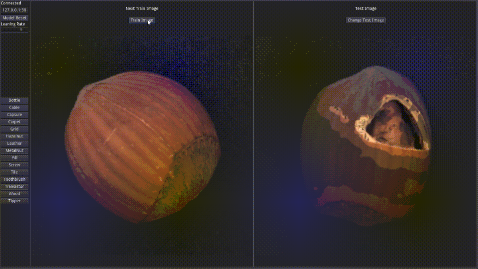

## Introduction
Anormaly detection test in godot project with pytorch CNN system.   
Target dataset is MVTec AD images (The MVTec Anomaly Detection Dataset: A Comprehensive Real-World Dataset for Unsupervised Anomaly Detection).   
Using model is pytorch FastFlow where https://github.com/gathierry/FastFlow.   
   
   
   
   
   
## Using

### Ip Address
Left top line edit section was connect URL address without "http://".   
If it can connect to server, upper label changed as "Connect".   
   
### Model Reset
Initialize model parameters button with learning rate where controlled by scroll bar.   
Learning rate also can be changed any time.   
   
### Change Material
Left side buttons can change MVTec dataset materials.   
But nor reset model parameters.   
   
### Train Button
Train model by using below image once.   
After that adjust test image and change train image which use next train time.   
   
### Change Test Image
Change test image and show anomal region which estimated by model.   
   
## Directories
   
### fastapi
python backend server for using deep learning model.   
It can run with "bash run.sh" refered config.json configuration file.   
   
config.json options were...   
"root_path" MVTec dataset folder path.   
"log_path" fastapi server log file path.   
"device" which used gpu device name.   
   
### godot_project
Frontend project files.   
godot version 3.5 mono, using C# script.   
   
### godot_html
WebGL exported godot frontend example files.   
It can run with "bash run.sh" command in ubuntu system.   
